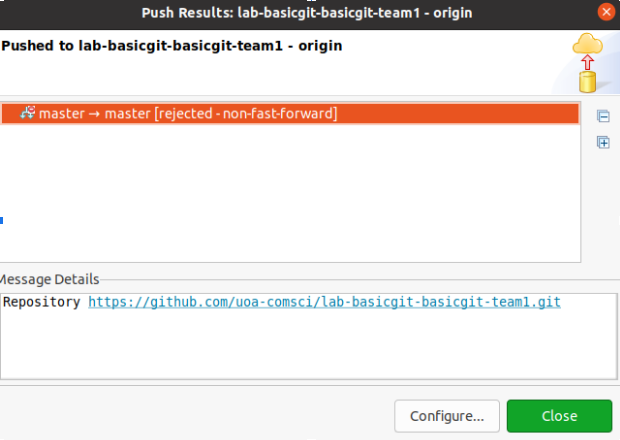
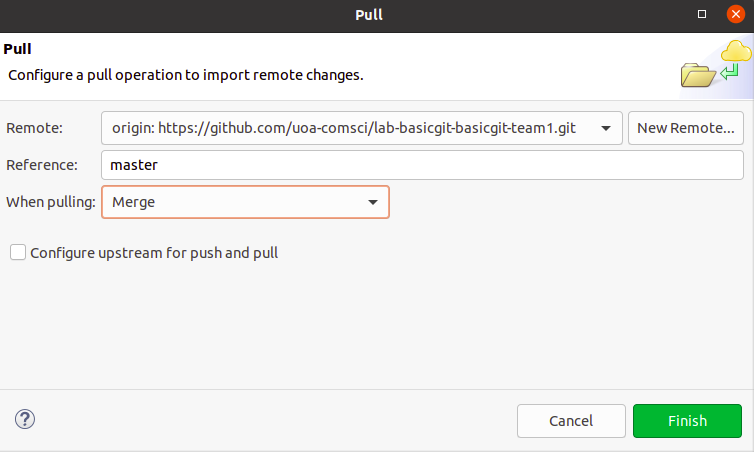
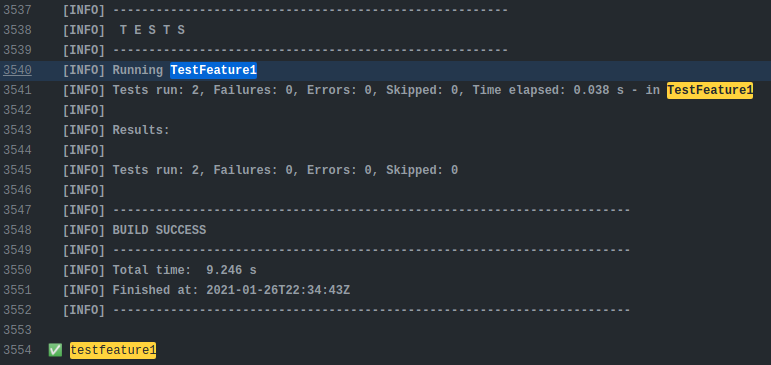
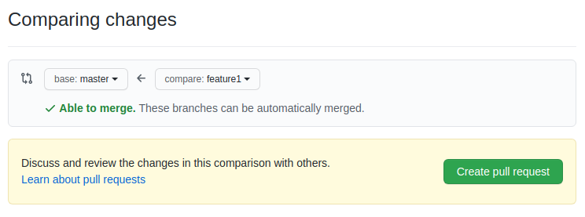
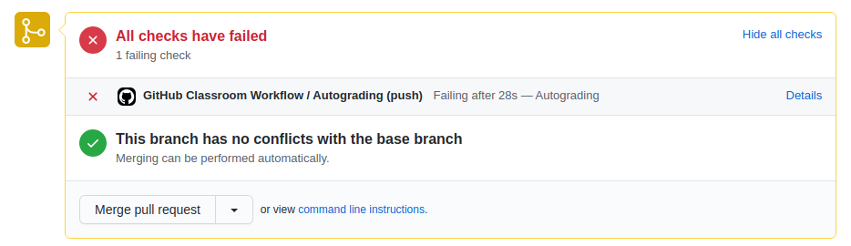
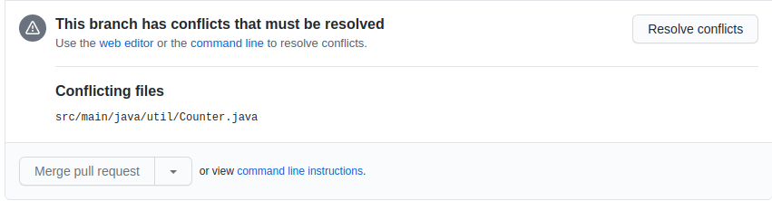
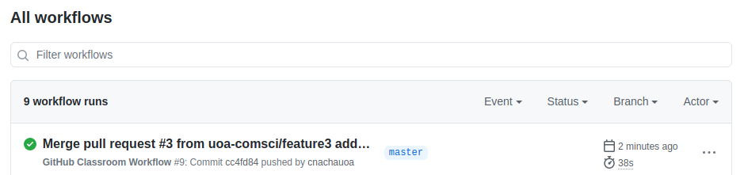

[](https://classroom.github.com/a/rxaXLFsz)
Lab - Git
======================
Welcome Dev Team :)

This lab explores the use of git (and GitHub) by a team. It assumes you are already familiar with the basics of git. Make sure to look at the details of assessment at the end of this file.
    
Issues arise when multiple people use the same git repository. The exercises in the lab explore some of them. It assumes you are working in a team of 3, consisting of team members Dev1, Dev2, and Dev3.

## Important note about branching and commit messages

**Main** - This branch is your "local" or "remote" main branch. Note that GitHub used to call it "master" until 2020. So, do not get confused when you see the term "master" in some of the GitHub screenshots below. On a side note, here is an interesting read about this name change: https://www.theserverside.com/feature/Why-GitHub-renamed-its-master-branch-to-main

**feature1, feature2 and feature3** (case sensitive) - These branches are to be created and used once you get to Exercise 2. **Please NEVER delete any branches. These are important for the markers.**

**submission** (case sensitive) - This branch is only for making your final submission for this lab, and must be used only after you have made all code corrections (for Exercise 1) AND implemented all specified features (for Exercise), and only one of the team members must push to this branch on behalf of the team. Read carefully the instructions and rules associated with this special branch in Exercise 2 description.

**Commit messages** - The commit titles as well as descriptions should be meaningful, professional and detailed. Note that your commit messages are meant to be read/used by others (in your team or elsewhere) for understanding the changes you made to the code. In short your commit messages must be described to contain the "what, why and how" of the commit. Read more about writing good commit messages [here](https://cbea.ms/git-commit/)

## How to enter your discussions/team communication?

Almost all GitHub Classroom based assessments in this course require team discussions to be entered using **GitHub Issues** feature. Your <tt>Team.md</tt> file must also summarize or refer to what you discuss in Issues. The purpose of the <tt>Team.md</tt> file is explained at different places in this document.

## Video Resources

[Importing and Configuring Java/Maven Projects in Eclipse](https://auckland.au.panopto.com/Panopto/Pages/Viewer.aspx?id=c14b498f-bdfd-4fef-b453-b3fb0011c016)

[Importing and Configuring Java/Maven Projects in IntelliJ](https://auckland.au.panopto.com/Panopto/Pages/Viewer.aspx?id=7b4351c9-c5fc-4bdc-9dc6-b3fb0011c084) 

[Basic Git/Github Starter (cmd and Eclipse) for Mac (note: uses Python project as example)](https://auckland.au.panopto.com/Panopto/Pages/Viewer.aspx?id=6255a381-a4aa-449a-a4c6-b3fb0011bff9)

[Other relevant resources for Git and Maven](https://canvas.auckland.ac.nz/courses/120717/pages/course-resources)
## Exercise 1 - Basic Git

For this exercise the three team members will individually complete the tasks
below to fix faults in their own copy of the repository. The issue is then how
to combine all of the changes into a single version on the remote repository. The three tasks followed by a Dev-wise task allocation are listed below.

You are given code for a GameCharacter class.

***Task 1: Fix how it heals***
Find and fix the fault in heal() method. All code changes and relevant commits must be performed on the main branch.

***Task 2: Fix how it takes the damage***
Find and fix the fault in takeDamage() method. All code changes and relevant commits must be performed on the main branch.

***Task 3: Fix how it resets to its best health***
Find and fix the fault in reset() method. All code changes and relevant commits must be performed on the main branch.

Each team member makes the change, commits it to their local repository (of
course making meaningful commit messages!) and then attempts to push the
changes to the remote repository. The first one should work without problems,
but for the second and third, the local repositories are now out of date with
respect to the remote repository. Note that all of this should be done on the main branch. **Using separate branches is for a later exercise.**

<ol>
  <li>Dev1,2,3 - clone the project to the local repository. Doing this
  in Eclipse as follows (note that use of Eclipse is not required):
  		<ul>
  			<li>import as a project from Git</li>
  			<li>Right click on project, Configure > Convert to Maven project</li>
  			<li>Run the project with "package" goal, all tests should fail</li>
  		</ul>
  <li>Dev1,2,3 - performs tasks 1, 2 and 3 (below) respectively on their own local source code</li>
  <li>Dev1 - stage, commit and push the changes for task 1</li>
  <li>Dev2 - perform code synchonisation as explained below and push the changes for task 2</li>
  <li>Dev3 - perform code synchonisation as explained below and push the changes for task 3</li>
</ol>

#### Testing ####
There are four test scripts in /src/test folder. The `TestGameCharacter` is for testing changes you have to perform for this exercise, while the others are for the next exercise. You should read the source code in this test script and find the test method that tests your task, for example, `testHeal()` is for testing Task1. After you make the change according to your task, you can execute this test script by running Maven with the `test` goal. This will compile and run all tests on the project. The task is complete when the test relevant to the task passes.

#### Continuous Integration ####

In COMPSCI 331 we will be using the continuous integration (CI) feature of
GitHub. Basically this means that whenever you push something to your
repository, some tests will be run. You will receive email summarising the
results of the tests. The results are also available on GitHub. **Note that for this course, CI workflow tests will only execute when pushing to the "submission" branch, and that there is a restriction that you may only push to submission 3 times max for all assessments in this course. Read the Assessment section for more details.** Further
information about CI are below and more will be provided in later labs. For
now, just be aware that any push to the "submission" branch (even if you are not changing code) will
cause the tests to be run and email sent to you. 

#### Code Synchonisation

When Dev2 and Dev3 try to commit and push their changes, the push should fail and show the error as shown in the figure below (Eclipse). This is because Dev1 has already pushed the source code to Git so the source code that Dev2 and Dev3 have is not in sync with the code on the remote repository. Github does not allow you to push the source code for this reason and therefore rejects the attempt.



The term "non-fast-forward" is a complicated way to say that there is a newer version of the file being pushed on the remote repository, usually because someone else has changed the file and pushed it to the remote repository. The command line message is slightly more useful:

```
! [rejected]        main -> main (non-fast-forward)
error: failed to push some refs to 'https://github.com/COMPSCI331-2022/week02lab-git.git'
hint: Updates were rejected because the tip of your current branch is behind
hint: its remote counterpart. Integrate the remote changes (e.g.
hint: 'git pull ...') before pushing again.
hint: See the 'Note about fast-forwards' in 'git push --help' for details.
```

Note the comment about <tt>git pull...</tt>, and you can ignore the
"fast-forwards" hint.

What Dev2 and Dev3 now need to do (first one, then the other, otherwise the
same problem will occur) is to perform a 'pull to merge'. This is done by issuing
a "pull" either through the IDE or command line (<tt>git pull</tt>).

From Eclipse, ensure "Merge" is selected when doing the merge.



From the command line when you run this command you will see something like:
```
Auto-merging filethatwaschanged.txt
CONFLICT (content): Merge conflict in filethatwaschanged.txt
Automatic merge failed; fix conflicts and then commit the result.
```

Now the file affected (in this case <tt>filethatwaschanged.txt</tt>) will have both sets of changes. When the <tt>pull</tt> is done (really the <tt>merge</tt> that is part of the <tt>pull</tt>), the two sets of changes are merged into the file, with annotations to show which is which. This will be shown in the file with something like:

```
<<<<<<< HEAD
one set of changes
=======
the other set of changes
>>>>>>> main
```

What the dev needs to do is figure out how to integrate these two sets of
changes, generally referred to as resolving the conflict. How this is done depends on exactly what the changes are. The
main thing is that the annotations (<tt>&lt;&lt;&lt;&lt;&lt;&lt;&lt;</tt>,
<tt>&gt;&gt;&gt;&gt;&gt;&gt;&gt;</tt>,
<tt>======</tt>) have to be removed. For example:
```
the other set of changes
one set of changes
```
In this case the decision was made to alter the order the changes appear in the
file. Now the file can be committed and pushed to the remote repository.

Once both Dev2 and Dev3 have resolved the conflicts this exercise is complete. 

## Exercise 2 - Git Branches

For this exercise, the three developers will again make three changes (this time adding features), but on different branches. 
**Before starting this exercise, please make sure that all three developers pull the latest source code from the repository and have read the following details along with all code comments for each method referred below.**

Feature 1 by Dev1 is to implement the method **levelUp()** that increases the game character level, and implement the method **isAlive()** that checks if the game character is alive.

Feature 2 by Dev2 is to implement the method **attack()** that attacks another game character, and implements the method **useSpecialAbility()** that provides a special ability to the game character.

Feature 3 by Dev3 is to refactor the code implemented by Dev1 and Dev2. The code refactoring should improve the overall quality of source code such as getting rid of duplicate code, apply the standard code style/conventions, and so on. Note that the refactoring task can only be performed after Dev1 and Dev2 have already merged their work to the main branch. At this point, Dev3 should pull the latest repo code, refactor it, provide code and commit comments about their refactoring changes, and then push their code to the remote repo.

#### Development Process

Each dev must work on these features on three separate branches, namely **feature1**, **feature2** and **feature3**, before merging them into the main branch. The overall process is:

<ol>
  <li>Dev1,2,3 - clone the project to local repository</li>
  <li>Dev1,2,3 - implement feature 1, 2 and 3 respectively locally</li>
  <li>Dev1 - run tests locally (Maven 'Verify'), stage, commit and push changes on the local feature1 branch</li>
  <li>Dev2 - run tests locally (Maven 'Verify'), stage, commit and push changes on the local feature2 branch</li>
  <li>Dev3 - run tests locally (Maven 'Verify'), stage, commit and push changes on the local feature3 branch</li>
  <li>Dev1,2,3 - run tests locally again (just to make sure), and then create a "pull request" (GitHub) to merge from your own branch to the main branch</li>
  <li>team leader approves the pull requests</li>
  <li>**IMPORTANT:** The final step will be to push your (**ONLY one of the team members; remember this lab requires a team submission**) code to the **"submission"** branch, which will trigger the CI workflow leading to you receiving an email about if your submission passed the required unit tests or not (build failed or passed). A fail message means one or more of the tests failed, and you must make further changes to your code before again committing and pushing to the "submission" branch. Detailed steps for how to create and manage the submission branch are listed in pts 1, 3 and 4 at https://www.cs.auckland.ac.nz/~ewan/teaching/submission-branch.html. Note that pt 2 is not valid for this exercise as the submission branch is not provided to you as the part of the repo.
</ol>

#### New Branch, Build and Test

Each dev needs to create a branch for the feature they are implementing as named above. Creating a branch from the command line is done with:
```
prompt> git branch feature1
```
In Eclipse, you can create a new branch by going to Team > switch To > New
Branch.

Once you have made the changes needed, commit them.  Make sure you are on your
own branch before making a commit.

There are three test scripts in place namely TestFeature1, TestFeature2 and TestFeature3 for testing each feature. A feature can be tested on a branch by using the goal in maven as **-Dtest=[test script] test**. For example, **-Dtest=TestFeature1 test** is for testing feature 1. Note that this is only to run the tests individually locally. The CI Workflow script only runs Maven's Verify goal once for all 9 tests. See the .github/workflows/autotest.yml. **You must not change the contents of this file.**

After committing the source code to a branch, Github classroom workflow (CI) will be executed. The figure below shows the log file (it also can be accessed from Github's Actions tab) after Dev1 has committed on feature1 branch; this shows TestFeature1 has succeeded, while TestFeature2 and TestFeature3 failed. Similarly, the execution of feature2 branch should have TestFeature2 succeeded, while TestFeature1 and TestFeature3 failed.  



There are a number of tutorials available on-line for how to use Git branching. A reasonable one
(although with more detail than needed for this lab) is by [Atlassian](https://www.atlassian.com/git/tutorials/using-branches)

#### Pull Request ####

The implementation of new features are separately stored on different branches. In order to combine all implementations, the branches for each feature needs to be merged into the main branch. To achieve this, each dev creates a pull requests on Github by going to Pull Request tab and click 'new pull request'. Then, select the branch to merge into main branch. Github will show the comparison of files on main branch and feature branch as the figure below.



If there is no conflict in the files, the branches can be automatically merged. However, if there is any conflict, the developer must resolve it when approving the pull request. This is done by clicking on 'Create pull request' and entering the message of this pull request for later approval.



On the approval as shown above, Github informs us that there is no conflict so we can choose to merge the pull request. However, if there is conflict as sample shown below, the conflict must be resolved before it can be merged into the main.




After that, the implementation of the feature will be added into the main branch. This process must be repeated for all three features.
  
## Build & Run project on GitHub ##

To see the results of building and running tests on Github (done using the "**submission**" (case-sensitive) branch only), go to the Action tab. GitHub Action is the CI-CD (continuous integration - continuous deployment) pipeline provided by GitHub. It is similar to other CI-CD pipeline platforms, e.g. Travis CI or Jenkins. In this project, there is a workflow already defined namely Github Classroom, as shown in the figure below. Every time code is pushed to the repository, this workflow will be queued to execute automatically. When this workflow runs successfully (as shown below), the exercise is complete. **Caution: There is a cap (at most 3 times) on how many times you may push to the "submission" branch, so you must make sure your have tested your final code locally before pusing to this branch. 



<h2>Assessment</h2>

The marking of this lab will be based on your team repository as of the Canvas deadline. As well as the changes made to it for the above exercises, you
must include a file <tt>Team.md</tt> containing the names, UPIs and GitHub identifiers of members in your
team, and a brief summaries of what role each member played. For example:

* Jack - Dev1 in exercise 1, Dev3 in exercise 2
* Brenda - Dev3 in exercise 1, Dev2 in exercise 2
* Peymon - Dev2 in exercise 1, Dev1 in exercise 1

If <tt>Team.md</tt> file is not provided, then there will be a **50% penalty**.

**Please NEVER delete any branches. These are important for the markers.**

**You must form a team and regularly contribute to your team communication via GitHub Issues throughout your lab work.** Some examples of this evidence could be: who does what, by when you plan to finish the exercises, constraints, planning/implementation/testing notes, issues, ideas, commenting on actions by other team members, resolving conflicts, etc. If you fail to add any notes to GitHub Issues, **25% penalty** will be applied to the lab mark. Your Team.md file should also contain references to your team discussion on Issues.

**Note that your team (one of the team members to push on behalf of the team) must NOT push to the "submission" (case-sensitive) branch on remote (GitHub repo) more than 3 times**. Executing workflows incurs cost, and you must make sure you do not violate this rule while making your submissions. **Violating this rule will bring penalties too**. To be safe, never push to submission branch unless you have fully tested your final code. See details under development, building and testing code above.

Overall, the assessment will be performed by examining the **code, commit logs, branching, Team.md, your team discussion comments (recorded in GitHub Issues "only") and other information associated with your team repository**. All this evidence must be directly accessible to the markers. In cases where you redirect the marker to a resource which is not accessible to the marker, the marker will ignore that part of your submission. To score, you must demonstrate that you have engaged with the lab material and fully participated with the team. This means we expect to see non-trivial commits, with meaningful commit messages, corresponding to each exercise. Different team members will do different things at different times, but we will be looking for evidence that there was team cooperation and collaboration. Examples including making useful commits, communications via GitHub Issues, etc.

<h2>Important last minute checks</h2>
Based on previous year submissions, here is a list of things to check before you make your submission.

- Do not delete branches after merges
- Pull requests should be merged by the team member who authored the commits. This is so we can properly gauge individual contributions
- Use the required branch names, exactly as specified in the lab brief
- Team.md needs to be in the submission branch
- Link your UPI to your Github account when creating/joining the assignment teams. In case you have issues/doubts, contact the teaching team immediately.
- Use Team.md to contain the task allocation information, Github Issues should have more detail about your process, meetings, planning and task allocation. Note that README.md clearly makes suggestions about what you can potentially include in Issues and Team.md too.
- Make sure your commit titles as well as descriptions are meaningful, professional and detailed
- Continuously monitor your git branching "tree". Using git log on command line along with its various keys might help -- e.g. use git log --oneline --decorate --graph --all.

Good Luck!

~COMPSCI331 team
